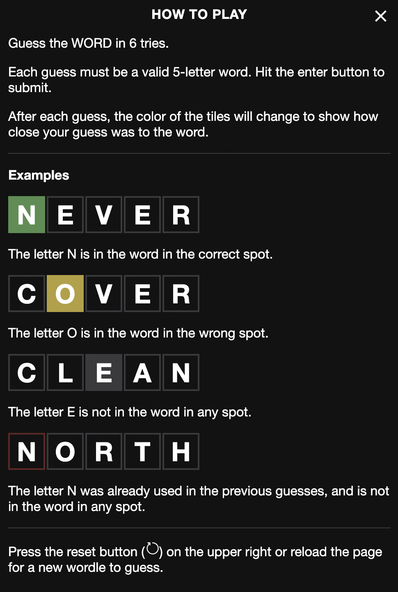
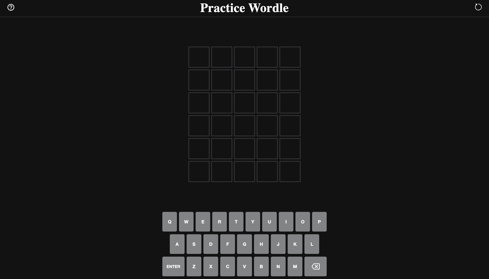

#  Practice Wordle

This is an app made for practicing the Wordle game!

Build with:
- Next.js
- React
- Typescript
- Redux
- Lottie React

## How to play



## Preview



## Getting Started

First, run the development server:

- Clone this repository on your local computer
- Run `npm install` and `npm start`

```bash
git clone https://github.com/kynadriel/practice-wordle.git
cd practice-wordle
npm install
npm start
```

Go to [http://localhost:3000](http://localhost:3000) the app should be running there.

## Your done!

Now you can play the game.
Feel free to play around with the code, and make a pull request if you want.